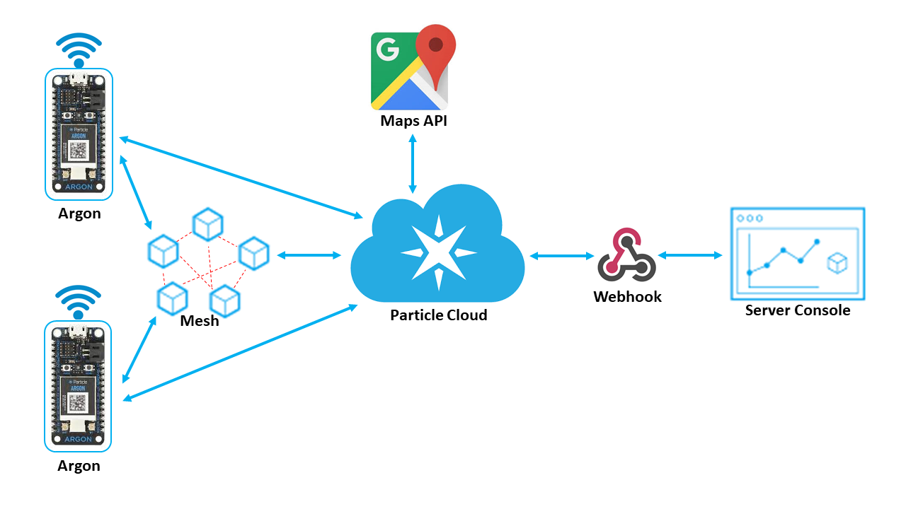

# MeshSOS

MeshSOS is an IOT project based on Particle IoT boards, aimed at creating a robust SOS emergency management system for senior citizens. It aims to provide a simplictic and reliable alternative to smartphone based emergency systems, that becomes more robust with an increasing user base.

Our paper [MeshSOS: An IoT Based Emergency Response System](http://hdl.handle.net/10125/71089) introducting this work has been accepted in the proceedings of the 54th HICSS (Hawaii International Conference on System Sciences), 2021.

[](https://opensource.org/licenses/MIT) [](http://shields.io)

## The Idea
The project aims to use mesh networking (Only available till Particle Device OS version 1.6.x) to increase the reliability of the emergency system.
The use of a mesh network allows the system to register a distress call with the central servers even if the caller device is not connected to the internet directly.
If even one device in the mesh has internet access, the system ensures that the message is received by the concerned authorities.

The user device is kept minimlistic with just 2 buttons, each dedicated to registering a specific emergency. The simplistic design of the device minimizes the steps required to register an emergency call and ensured the device lasts long on a limited battery storage with minimal maintenance. This ensure that th device is always ready to perform its task elegantly at the very moment it is required to.

Also, the system tries to provide the geolocation of the device which is sending the distress signal to aid the authorities. The location can then be used to get the optimal route to the person who sent out the distress call.



## Devices
This project was made using the Argon (Bluetooth + WiFi) IOT boards from [Particle](https://www.particle.io/).
These devices have in-built mesh networking capabilities (currently being deprecated; unavailable after Jan 2021).

## Integrations

#### Google Maps API
The geolocating feature of the API has been used to get the location of the device before sending out a distress call. The server has the option to show the location on a map, and also show the best route to the location. This integration is done by the means of a webhook which is triggered using the ```google-maps-device-locator``` Particle library.
#### Webhook To A Central Server
A central server is kept active which receives the SOS calls made from the devices. The webhook is triggered by the ```emergency``` events published on the Particle console. Once the data is sent to the server, the further handling of the situation is done by the authority-end console.

## Working
The sequential working of the project is shown in a simplified manner in the [sequence diagram](images/sequence-diagram.png).

## Device Firmware
The firmware for Particle Argon boards is contained in the `argon-firmware` directory. 

Please refer to the [README](argon-firmware/README.md) in argon-firmware for details and circuit schematic.

## Network Analytics
The `analytics` directory contains logs related to round trip time in the network and process resolution times
(time from initiating an emergency call to either a positive acknowledgement or failed process).

The jupyter notebook contains the analysis of the information and plots for the same.

## The Server
The server for this project was created by [Kaustubh Trivedi](https://github.com/codekaust).
The `django-server` directory contains the code for the server.

Please refer the [README](django-server/README.md) in django-server for details.

## The Console
The admin dashboard for this project is contained in a separate repository [meshsos-dashboard](https://github.com/bhavyejain/meshsos-dashboard).

This console provides a minimalistic interface for emergency services providers to locate the device that sent the SOS call, get the optimal directions to reach them, and manage the flow of handling of emergency calls. Please have a look at the README in the meshsos-dashboard repository for more detailed information.

## Future Developments
Due to the current unavalability of LTE Cat M1 supported SIM cards in India, we were not able to add the Particle Boron IoT boards (LTE + Bluetooth) to the mesh network. We plan to introduce devices with LTE capability in the mesh so that the network is not solely reliant on WiFi for its functioning.

The project might explore the possibility of data analytics to recommend the deployment of emergency services vehicles once enough data can be obtained to develop a reliable analytics system. Currently, only a simple visualization of the events is provided in the admin dashboard of the project.

Since Particle will be removing the support for mesh networking shortly, we might build a MeshSOS Cloud to process incoming requests instead of the Particle cloud. This could be a complex component to develop and might remain on the design board until it is necessary to build.

The future schematic of the system might look like this:

