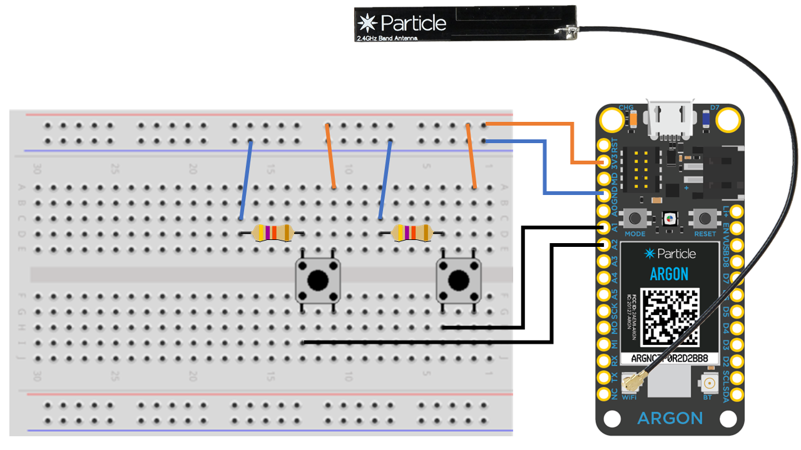

# Argon Firmware

This directory contains the source code of the firmware for Particle Argon boards.

## Directories
* **firmware** : Contains the final binary for the argon board. This firmware can be flashed onto an Argon via USB.
* **lib** : Contains the source code for the libraries used in the project
* **src** : Contains the source code for the firmware of the project

## Device OS and Libraries

The target Device OS version for this project is deviceOS@1.4.4 for Argon.

The libraries used in the project are:
* google-maps-device-locator
* JsonParserGeneratorRK
* DiagnosticsHelperRK

## Source Files

The header file `publish-utilities.h` contains helper functions to publish messages in the mesh or to the console.

The INO file `sos-firmware.ino` contains the main firmware code for Argon boards.

The code is well-commented for being self explanatory.

## Working
The sequential working of the project is shown in a simplified manner in the [sequence diagram](images/sequence-diagram.png).

## Flashing the Argon with firmware

Connect the device via a USB cable and enter the following commands in `Particle CLI` sequentially to flash the device with the firmware.

1) Make the device enter DFU mode
```sh
particle usb dfu [device_name_if_multiple_deviced_connected]
```
2) Navigate to the directory containing the `.bin` firmware

3) Flash the device with the firmware
```sh
particle flash --usb .\firmware_argon_v302.bin
```

## Create mesh and add devices via Particle CLI (might work post deprication)
Particle documentation:

https://docs.particle.io/reference/developer-tools/cli/#particle-mesh

## Some helpful commands for particle CLI (Device connected via USB)

`particle serial wifi` : To connect to a wifi via CLI.

`particle usb listen` : To put the device into listening mode.

`particle usb stop-listening` : To exit listening mode.

`particle serial monitor` : To open the serial monitor for serial logs.

`particle flash --usb tinker` : Reset device to tinker app (original firmware of device) post development-apocalypse if the device is going crazy.

## Circuit connection schematic
